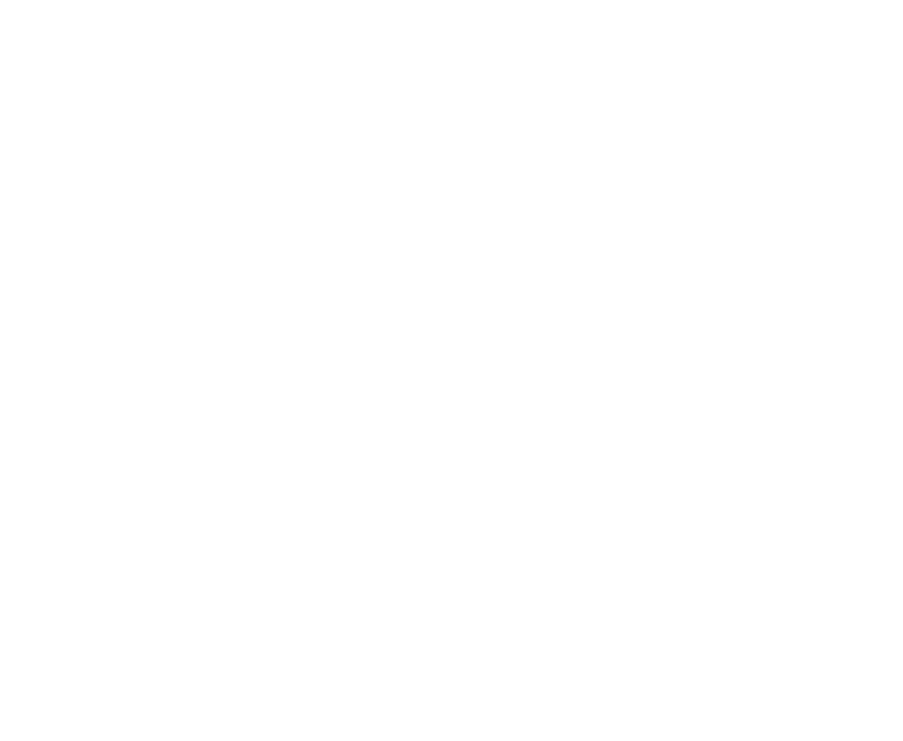

<div align="center">
  <br />
  
  <br />
  <br />
  <p><strong>The Intent-Driven Autonomous Economy on Somnia Agentic L1</strong></p>
</div>

---

## Overview

**Noventra** replaces rigid smart contracts with a self-healing, multi-agent AI swarm. Users simply submit natural language **intents** (e.g., *"Yield farm my STT safely"*), and a decentralized network of specialized AI agents negotiates, strategizes, and executes the optimal path directly on the Somnia Testnet.

Built for the **Somnia Agentathon**, Noventra bridges the gap between High-Frequency Trading (HFT) concepts and ultra-fast LLM reasoning.

## Swarm Architecture

Noventra operates using a decentralized, event-driven `MessageBus` smart contract deployed on Somnia. Agents do not use rigid REST APIs; they listen to the blockchain and react autonomously.

1. **User Intent:** Submitted via the React Frontend dashboard.
2. **Strategy Agent (The Brain):** Powered by **Groq**. It listens for user intents, analyzes current market data, and proposes an optimal yield strategy via an on-chain `STRATEGY_PROPOSED` signal.
3. **Execution Agent (The Solver):** A specialized TypeScript daemon. It listens for approved strategies, handles the complex cryptographic signing, and executes the raw transaction on the Somnia EVM, leaving an immutable `INTENT_SOLVED` receipt.

## Tech Stack

<p align="left">
  
  
  
  
  
  
  
  
</p>

---

## Local Setup & Installation

### 1. Clone & Install
```bash
git clone https://github.com/krishnagoyal099/Noventra.git
cd Noventra
npm install
cd frontend && npm install
cd ..
```

### 2. Environment Variables
Copy the template and fill in your keys:
```bash
cp .env.example .env
```
*You will need a [Groq API key](https://console.groq.com/) and a Somnia Testnet private key.*

### 3. Deploy Contracts to Somnia
```bash
npx hardhat run scripts/deploy.ts --network somnia
```
*Take the deployed `ALOCore` address and paste it into your `.env` file as `SOMNIA_ALO_CORE_ADDRESS`.*

### 4. Fund Your Agents
The agents need gas to execute transactions on your behalf. Grab some STT from the [Somnia Faucet](https://faucet.somnia.network/) and run:
```bash
npx hardhat run scripts/fund-agents.ts --network somnia
```

### 5. Launch the System

**Start the AI Swarm Worker (Terminal 1):**
```bash
npx ts-node scripts/listen-somnia.ts
```

**Start the Frontend Dashboard (Terminal 2):**
```bash
cd frontend
npm run dev
```

---

## Production Deployment

Ready to go live? Noventra is fully containerized and production-ready.

- **Frontend:** Pre-configured for seamless deployment to Vercel via `frontend/vercel.json`.
- **Agent Swarm:** Included `Dockerfile`, `docker-compose.yml`, and `Procfile` for deploying the 24/7 worker on Railway, AWS, or DigitalOcean.

See [DEPLOY.md](./DEPLOY.md) for detailed step-by-step production deployment instructions.

---

<div align="center">
  <p><i>Built for the Somnia Agentathon</i></p>
</div>
